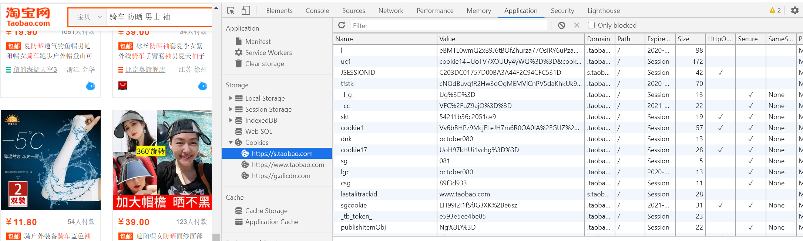

# HTTP状态码
### 重点：
- 2**：成功
200：OK
201：Created 新增成功
- 3**：重定向
301：Moved Permanently 永久重定向
302：Found 临时重定向
- 4**：客户端错误
403：Forbidden 权限不足
404：Not Found 请求失败
- 5**：服务端错误
500：Internal Server Error 服务端错误

### 明细：
https://zh.wikipedia.org/wiki/HTTP%E7%8A%B6%E6%80%81%E7%A0%81

# http请求方式
### 分类
- get 查询
- post 修改
- put 新增
- delete 删除
- options 预检请求（用于跨域访问）

### get和post的区别
- get请求都是以query string的方式，接在general里面的request url上面；
- post要带的信息是body里面的request payload里面，不在url上面

# SEO优化
- head标签里面的description和keywords命中关键词
- ssr（server side render）服务端渲染
- 伪静态:伪静态是给爬虫准备一份纯HTML
- 用户停留页面时长
- 外链：其他页面对于当前页面的引用
违规操作：（1）套娃（2）伪静态
- 页面存在的时间
- 百家号（自媒体平台）
- 语义化的HTML标签（选择符合语义的标签）
- img alt属性（鼠标放到这个图片上时，就会显示alt里的内容）

# web会话跟踪
- cookie&session
session把用户数据以对象形式保存在服务端，生成Session时，会默认设置一个cookie值为sessionId的cookie保存到客户端。

- URL复写

- 隐藏表单域

