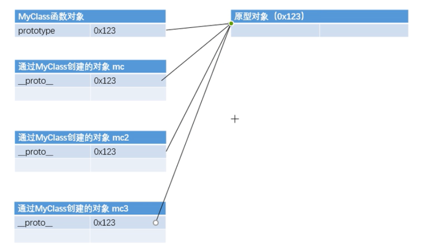

### 用递归算法实现，数组长度为5且元素的随机数在2-32间不重复的值。
```js
function buildArray(arr, length, min, max) {
    var num = Math.floor(Math.random() * (max - min + 1)) + min;
    if (!arr.includes(num)) { arr.push(num); }
    return arr.length === length ? arr : buildArray(arr, length, min, max);
}
var result = buildArray([], 5, 2, 32);
console.log(result);
```

### 返回到顶部的方法有哪些？
```js
window.scrollTo(0,0); //ie不支持，但好用
document.documentElement.scrollTop = 0;
location.href += '#';
```
### 数组去重的办法
```js
[...new Set(array)]
```

### 获得精确小数的方式
```js
parseFloat((0.1+0.2).toFixed(10)) === 0.3//true
```

### 让一个数组乱序
```js
方法1:
arr.sort((a, b) => Math.random() - .5)
方法2:洗牌算法
let arr= [1,2,3,4,5,6,7,8,9,10];
arr.forEach((item,index)=>{
    let random =Math.floor(Math.random() * arr.length);
    [arr[index],arr[random]] = [arr[random],arr[index]];
});
console.log(arr);
```

### 内存泄漏
- 定义
由于设计错误，导致在释放该段内存之前就失去了对该段内存的控制，从而造成了内存的浪费。
- 后果
影响系统运行速度
- 成因
1、死循环函数、递归
2、对象的引用地址丢失

### 写一个获取数组的最大值、最小值的方法
```js
Math.max.apply(Array,[25,62,91,78,34,62]) //  91
Math.min.apply(Array,[27,64,90,78,34,62]) // 27
```

### promise 的常用方法
- promise.then

- promise.catch
```js
new promise((resolve,reject)=>{
    reject(1)
}).then(value =>{
    console.log(value)
    //最后指定失败回调，可以改写成以下两种方式
    //reason =>{throw reason}
    //reason => promise.reject(reason);
}).then(value =>{
    console.log(value)
}).catch(reason=>{
    console.log(reason)
})
```

- promise.race
当iterable参数里的任意一个子promise被成功或失败后，父promise马上也会用子promise的成功返回值或失败详情作为参数调用父promise绑定的相应句柄，并返回该promise对象。

- promise.all
promise对象在iterable参数对象里所有的promise对象都成功的时候才会触发成功

### 闭包
``` js
function makeFunc() {
    var name = "Mozilla";
    function displayName() {
        alert(name);
    }
    return displayName;
}

var myFunc = makeFunc();
myFunc();
// 内部函数可以访问上级作用域的变量
```
### 对于模块化的理解
node用的是CommonJS，“require”
前端用的是ESModule，“import”
ps：最新版的nodeJS已经支持ESModule语法；

# NodeJs的理解
- 服务端编程语言，语法和js一样；
- 和ESModule的区别；
1、不存在window对象；
2、引入方式不同（require/import）；
3、NodeJs多很多接口；
```
eg：fileApi（用于操作本地文件）
process（进程/线程管理）
stream(流)
```

### apply、call、bind 的异同
call、apply、bind都是为了解决改变this的指向。
call、apply作用是相同的，只是传参的方式不同。除了第一个参数外，call可以接收一个参数列表，apply只接受一个参数数组。 
bind绑定完之后返回一个新的函数，不执行。

**详细说明**:https://www.runoob.com/w3cnote/js-call-apply-bind.html

### 深拷贝、浅拷贝
```js
const carts = [
    {name: '裤子', price: 1, count: 1},
    {name: '鞋', price: 3, count: 1},
    {name: 'T恤', price: 2, count: 2},
    {name: '毛衣', price: 0, count: 1}
]

// 浅拷贝
const newCarts = [...carts];

// 深拷贝
const newCarts = [];
carts.forEach((item) => {
    newCarts.push({...item});
})

console.log(carts === newCarts);
console.log(carts[0] === newCarts[0]);
```

### 捕获异常的方式
- 全局捕获未处理的
```js
window.onerror = function(message, source, lineno, colno, error) { ... }
```
- 全局捕获未处理的Promise rejection
```js
window.onunhandledrejection = function(e) {
  console.log(e.reason);
}
```
- 非异步且不是Promise的异常捕获
把异步操作用 Promise 包装，通过内部判断，把错误 reject，在外面通过 promise.catch 捕获。
```js
const p3 = () =>  new Promise((reslove, reject) => {
  setTimeout(() => {
    reject('async error');
  })
});

function main3() {
  p3().catch(e => console.log(e));
}
main3();
```

### 事件循环

**详细说明**：https://zhuanlan.zhihu.com/p/78113300