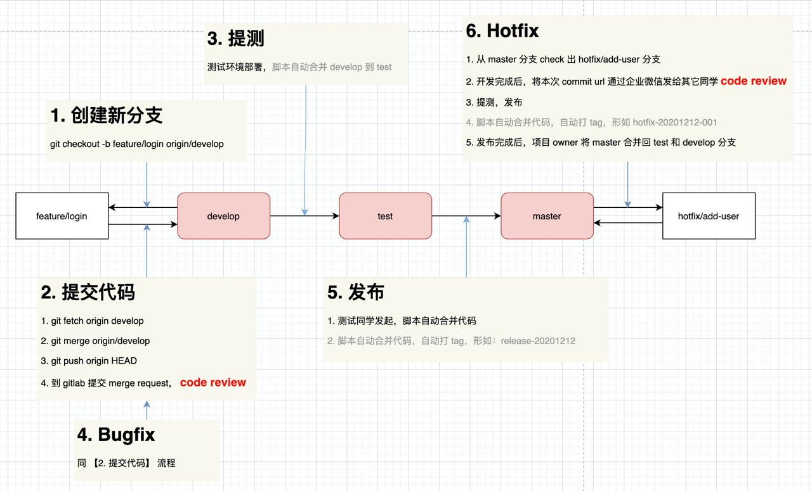

### 分支管理

- checkout出来的分支，就是本地的分支；
- 第二步提交代码前，需要git add . git commit -m"***";
- HEAD标识当前分支,origin标示远程;
- merge 是为了多人提交，不会出现代码覆盖的问题,每次开发前后都要git merge，减少冲突；
ps:提交代码步骤1:把远程develop分支的代码merge到本地分支来
- create merge request不是属于某个分支，assignee选择review人，submit即可；

### 切换分支:
- 切换到develop分支 `git checkout develop`
- 如果本地分支落后于远程分支（仅限于统一名称本地向远程分支拉数据）用 `git pull`
- 生成新分支 `git checkout -b feature/batch`
- 忘记生成新分支怎么版？
`1.git stash 2.git pull 3.git checkout -b feature/admin 4.git stash apply`

### ps
- 假设目前在 feature/batch 分支，`git fetch origin`是将远程仓库完全同步到本地仓库，必须配合`git merge develop`使用（把develop分支内容不同到feature分支）

