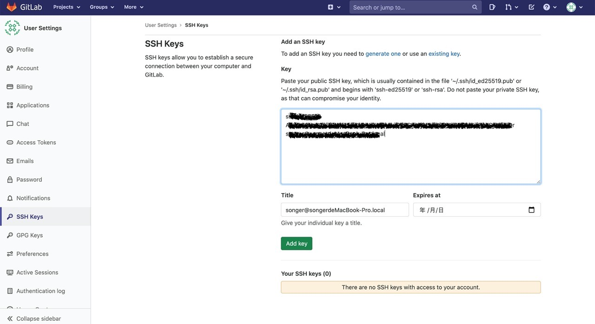

### 通过ssh key的方式连接代码库
这种方式不需要每次push输入密码
1.打开命令行，输入ssh-keygen -t ed25519，一直敲enter
2.cd到 ~/.ssh目录，用cat命令查看一下公钥内容： cat id_ed25519.pub，复制；
3.点击右上角头像 -> setting -> SSH Keys
4.将公钥复制到SSH Keys的文本框，保存
5.在项目文件下，git clone地址（Clone with SSH），生成本地文件夹；
