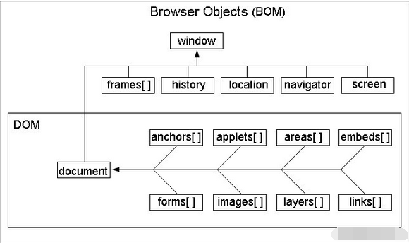
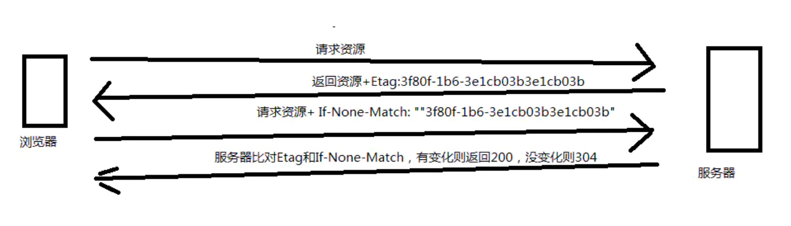
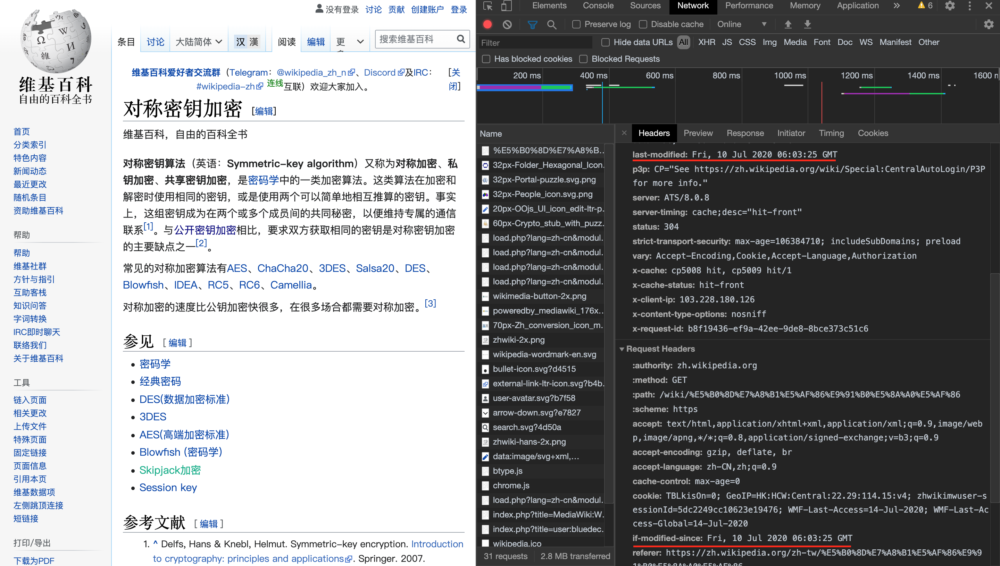

# HTTP状态码
### 重点：
- 2**：成功
200：OK
201：Created 新增成功
- 3**：重定向
301：Moved Permanently 永久重定向
302：Found 临时重定向(l临时停服)
- 4**：客户端错误
403：Forbidden 权限不足
404：Not Found 请求失败
- 5**：服务端错误
500：Internal Server Error 服务端错误

### 明细：
https://zh.wikipedia.org/wiki/HTTP%E7%8A%B6%E6%80%81%E7%A0%81


# http请求方式
### 分类
- get 查询
- post 修改
- put 新增
- delete 删除
- options 预检请求（用于跨域访问）

### get和post的区别
- get请求都是以query string的方式，接在general里面的request url上面；
- post要带的信息是body里面的request payload里面，不在url上面

# SEO优化
- head标签里面的description和keywords命中关键词
- ssr（server side render）服务端渲染
- 伪静态:伪静态是给爬虫准备一份纯HTML
- 用户停留页面时长
- 外链：其他页面对于当前页面的引用
违规操作：（1）套娃（2）伪静态
- 页面存在的时间
- 百家号（自媒体平台）
- 语义化的HTML标签（选择符合语义的标签）
- img alt属性（鼠标放到这个图片上时，就会显示alt里的内容）
- url重写

# web会话跟踪
- cookie&session
session把用户数据以对象形式保存在服务端，同时生成一个sessionId，并且以setCookie的方式，放在Response headers里面，返回给浏览器。


- token（包含用户信息的加密的串）
用户首次登陆，通过加密算法，将明文部分（eg：uid）+ 明文部分和秘钥生成的加密文件，放在cookie里面返回浏览器。当用户之后请求数据的时候，cookie中携带的token在服务端解密，明文部分和加密文件中的明文部分一致，则用户身份通过验证，可直接从token上获取需要的字段。

- token相较于session的优点
session对于数据库请求的压力很大，token则自带需要的信息，可以直接从token上取。

# viewpoint的使用
``` <meta name="viewport" content="width=device-width, initial-scale=1.0"> ```
还可能用到的设置：minimum-scale、maximum-scale(最大缩放值)、user-scalable（是否允许缩放）；

# DOM和BOM的区别
### DOM
是Document Object Model的缩写，即文档对象模型。他们都是浏览器提供给JavaScript的API接口。

### BOM
是Browser Object Model的缩写，即浏览器对象模型。

### 常用BOM对象

- history：

当前浏览的历史记录；

用法：history.push("页面链接")

React Router 用的是history管理，用来管理url对应组件关系的路由。

- location

用法：location.href/location.search/location.domain

- navigator

存储浏览器信息

用法：navigation.useragent



ps：window.setTimeout是js对象；

# 相比html,html5新增了哪些结构标签？
- 结构标签语义话，便于代码阅读；
- aside 侧边
- section 区块
- header 顶bar
- nav 导航栏
- footer 底bar（企业资质信息）

# 重排&重绘
### 触发重绘的条件：
改变元素外观属性。如：color，background-color，font-size等。

### 触发重排的条件：

任何页面布局和几何属性的改变都会触发重排，如下：
- 增删DOM元素
- 元素位置、尺寸变化，如：width、height、pading、margin、position
- 浏览器尺寸变化、文本的改变或图片大小改变
- 获取元素高宽（为了保证拿到的高宽是准确的，系统每次都是强制清空队列，即flush。如：offset-top（离浏览器上方的距离）、scroll-top（滚动条距离上边缘的距离）；

### 优化
- 浏览器批处理（浏览器自优化）
- 把需要的数据存在变量里面，不要经常访问浏览器的flush队列属性。如：循环li，放到一个数组里面，最后一起append到ul里面，可以变面多层次重排；
- 使用DocumentFragment创建完后一次性的加入document

# 发送请求依次经过哪些节点
1、客户端
2、浏览器是否命中强制缓存或者协商缓存？
3、域名通过DNS解析成ip地址；
4、建立链接，TPC 3次握手；
5、发送HTTP请求至CDN，看CDN有没有缓存；
6、没有的话，达到网关服务器Nginx（负载均衡）；
7、再由Nginx将请求分配到某一台服务器上面；

# TCP和UDP的区别
- TCP协议
用来建立客户端和服务端之间的链接；通过规定格式的来传递数据；
三次握手确保了双方通讯畅通，因此是一种连接的、可靠的、基于字节流的传输层通信协议；

- UDP协议
不校验对方是否收到数据，优先建立链接，因此比较TCP,并不可靠；
应用场景：直播/视屏；

# 缓存
### 为什么要有缓存？
资源缓存，可以节省带宽、提高加载速度、降低服务器压力；

### 缓存类型

#### 强制缓存
- 浏览器不会像服务器发送任何请求，直接从本地缓存中读取文件并返回Status Code: 200；
- 强缓存的header参数：
1、Expires：过期时间 （http1.0）
2、cache-Control：常用设置值如下：（http1.1）
（1）max-age（过期时间）
（2）no-cache（强制客户端直接向服务器发送请求，判断资源是否变更，是则返回新内容，否则返回304，未变更）
（3）no-store（禁止一切缓存）

#### 协商缓存
向服务器发送请求，服务器会根据这个请求的request header的一些参数来判断是否命中协商缓存，如果命中，则返回304状态码并带上新的response header通知浏览器从缓存中读取资源；

- Etag/If-None-Match：（HTTP1.1）


- Last-Modified/If-Modified-Since：（HTTP1.0）
1、Last-Modified：
浏览器向服务器发送资源最后的修改时间
2、If-Modified-Since：
当资源过期时（浏览器判断Cache-Control标识的max-age过期），发现响应头具有Last-Modified声明，则再次向服务器请求时带上头if-modified-since。服务器收到请求后，发现有if-modified-since则与被请求资源的最后修改时间进行对比（Last-Modified）,若最后修改时间较新（大），说明资源又被改过，则返回最新资源，HTTP 200 OK;若最后修改时间较旧（小），说明资源无新修改，响应HTTP 304 走缓存。


**详细说明**：https://juejin.im/post/5ccfccaff265da03ab233bf5

# 前端性能优化的方案
### 为什么要做前端性能优化？
提升首页加载速度；
### 如何进行优化？
#### 性能分析
使用工具performanceApi，找到系统瓶颈（页面刷新时间）；
#### 性能优化
- 优化加载（资源请求）
1、分拆打包（eg:首页单独打包）
2、缓存（需要服务端同学配合）
- 优化渲染（页面渲染）
1、懒加载：只显示视口内资源，有拖动行为或者**秒后，加载下面页面的内容；
2、图片使用webp格式；
3、合并请求；
雪碧图：小图标合并
接口合并，多个接口合并成一个接口（ps：http1.1，请求多了，会排队，但在http2.0时代，不会有1.1的问题，并且鼓励多接口请求）
4、快照：将上一次登陆的首页，整个DOM保存到localstorage，下次用户打开应用时直接渲染到页面（root），同时请求新的资源；
5、骨架屏（可期待的心理状态）
#### 优化后效果对比
使用工具performanceApi再次统计用户打开页面时间，对比优化前数据，即可获得前端性能优化的效果；

# 对称加密和非对称加密
### 对称加密
加密和解密时使用相同的密钥；

### 非对称加密
公钥用作加密，私钥则用作解密；eg：https、MD5；

# 对于前端安全，说说XSS和CSRF的理解
### XSS：跨站脚本攻击；
通过注入js的方式，偷网站信息，如cookie；
eg：输入框的内容用的是innerHTML的话，在里面输入，script标签里面代码会执行；
偷cookie；
### CSRF：跨站请求伪造；
不在你网站上，发你网站的请求，偷钱偷积分；
eg:一个无防护的支付请求，a向b转账100元，请求从浏览器到服务端的过程中，运营商可以看到请求的内容，根据内容重新发起请求，再次转账；
- 防护方式：
1、HTTPS
2、request header里面referer指定，从哪个页面跳过来的；
3、幂等：设置账户余额为300的情况下，余额为200；
4、请求一次性有效（请求里面带签名，第二次发的请求不合法）

# 跨域访问
当一个资源从与该资源本身所在的服务器不同的域、协议或端口请求一个资源时，资源会发起一个跨域 HTTP 请求。(域名可以解析成ip和端口，ip或端口任意一个不同，都无法ping通)；

1、跨域资源共享(CORS) 是一种机制，它使用额外的 HTTP 头来告诉浏览器  让运行在一个 origin (domain) 上的Web应用被准许访问来自不同源服务器上的指定的资源。（被访问的服务端配置```allow origin:* ```,浏览器放行）；

2、任何HTML元素的src属性，浏览器都会允许跨域；```eg：<a>```

3、server proxy（服务器代理）
nigix（转发）和webpack（启动服务）
由于浏览器限制，无法访问跨域网站，所以由服务器转发请求；


**详细说明**https://developer.mozilla.org/zh-CN/docs/Web/HTTP/Access_control_CORS

# HTTP协议发展
- HTTP/0.9时代：短连接
- HTTP/1.0时代：持久连接概念提出
客户端在请求header中携带Connection
- HTTP/1.1时代：持久连接成为默认的连接方式；提出pipelining概念
弊端 —— HOLB（Head of Line Blocking）：请求串行，前面的请求堵塞，还是会后续请求被阻塞；
- SPDY和HTTP/2：multiplexing
请求和相应混杂进行，用streamId来区别。

**详细说明**https://www.zhihu.com/question/51996213/answer/128801185

# HTTP和HTTPS的区别
- HTTP是超文本协议，默认端口是80，以明文方式传输。
- HTTPS是HTTP协议的安全版，安全基础是SSL，以密文方式传输。

# 新增form元素及属性
**详细说明**：https://blog.csdn.net/u010556394/article/details/50769853

# CDN
将用户的访问指向距离最近的缓存服务器上，由缓存服务器响应用户请求。
优点：加速网站访问

# src、href、link的区别
href是Hypertext Reference的缩写，表示超文本引用。常用的有：link、a。link是html标签。
```html
<link href="reset.css" rel=”stylesheet“/>
```
src表示引用资源,常用的有：img、script、iframe。
```html
<script src="script.js"></script>
```