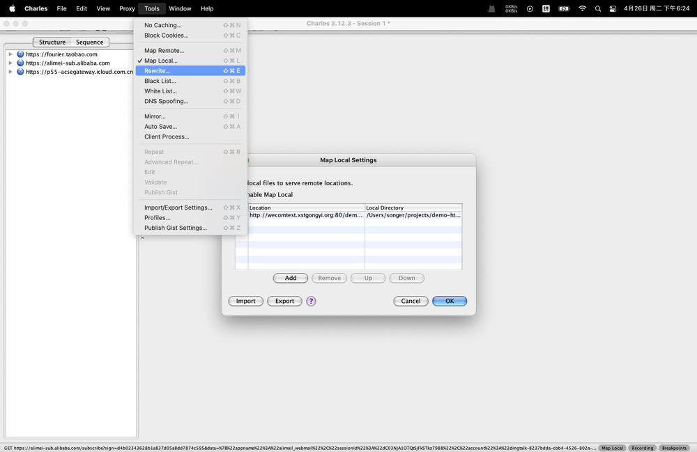

## 企微新建及相关配置

### 注册企业微信 
地址： `https://work.weixin.qq.com/`

### 新建侧边栏应用
- 应用管理


### 应用配置
- 点击创建好的应用
- 配置应用主页
- 配置到聊天工具栏


### 配置可信域名
- 配置可信域名


- 配置内容说明
    - 可作为应用OAuth2.0网页授权功能的回调域名
        >用于打通企业微信和我们的用户体系，即免登录，需服务端支持
    - 可调用JS-SDK、跳转小程序的可信域名（最多10个，需完成域名校验）
        >配置了才能调用微信提供的sdk
    - 完成域名归属验证
        >需要将指定文件上传至填写的域名的根目录下，作为上一步可信域名配置的验证
- 注意事项
    - 可信域名必须是备案过的域名，不能使用ip地址或localhost

### 登陆新注册的企业微信
- 添加新的用户

- 侧边栏入口


## 前后端代码
- 企微侧边栏前后端串联逻辑


- 注意点
    - wx.config 和 wx.agentConfig 都是必要的。
    - agentConfig仅在企业微信2.5.0及以后版本支持，微信侧不支持（微信开发者工具也不支持），因此在开发者工具内报错且无法解决时，可以尝试去企微内进行验证。
    - 获取jsapiTicket的api调用次数有限，开发者必须在自己的服务全局缓存jsapiTicket，有效期2小时。
    - accessToken需要保存在服务端，有效期2小时，但可能提前失效，开发者应实现accessToken失效时重新获取的逻辑。

- 后段代码
```js
import express from 'express';
import fetch from 'node-fetch';
const app = express()
const port = 8000
const corpId = '***********';
const corpSecret = '*************';

// 中间件 服务端增加日志逻辑
app.use(function (req, res, next) {
    console.log(req.originalUrl);
    next();
})

app.get('/', (req, res) => {
    res.send('Hello World!')
})

// 减少accessToken请求次数
let accessToken = null;

setInterval(() => {
    accessToken = null;
}, 300000)

// 获取accessToken
async function getAccessToken() {
    if (!accessToken) {
        let tokenRes = await fetch(`https://qyapi.weixin.qq.com/cgi-bin/gettoken?corpid=${corpId}&corpsecret=${corpSecret}`)
        accessToken = (await tokenRes.json()).access_token
        console.log(accessToken);
    }
    return accessToken;
}

// 获取企业jsApiTicket，返回给前端
app.get('/getJsApiTicket', async (req, res) => {
    let accessToken = await getAccessToken();
    let ticketRes = await fetch(`https://qyapi.weixin.qq.com/cgi-bin/get_jsapi_ticket?access_token=${accessToken}`)
    let { ticket: jsapiTicket } = await ticketRes.json()
    res.send(jsapiTicket);
})

// 获取应用jsApiTicket，返回给前端
app.get('/getAgentJsApiticket', async (req, res) => {
    let accessToken = await getAccessToken();
    let ticketRes = await fetch(`https://qyapi.weixin.qq.com/cgi-bin/ticket/get?access_token=${accessToken}&type=agent_config`)
    // let result = await ticketRes.json()
    // res.send(result)
    let { ticket: agentJsApiticket } = await ticketRes.json()
    res.send(agentJsApiticket)
})

app.listen(port, () => {
    console.log(`Example app listening on port ${port}`)
})
```

- 前端代码
```js
const appId = '*****';
const nonceStr = '******';
const timeStamp = Date.now()
const url = window.location.href.split('#')[0];
const corpId = '******';
const agentId = '******';

async function getJsApiTicket() {
    let res = await fetch('http://test.com/demo-server/getJsApiTicket');
    let jsapiTicket = await res.text();
    return jsapiTicket
}

async function getAgentJsApiTicket() {
    let res = await fetch('http://test.com/demo-server/getAgentJsApiticket');
    let agentjsapiTicket = await res.text();
    return agentjsapiTicket
}

// 根据企微文档，使用sha1加密
function getSignature(jsapiTicket) {
    return CryptoJS.SHA1(`jsapi_ticket=${jsapiTicket}&noncestr=${nonceStr}&timestamp=${timeStamp}&url=${url}`).toString();
}

getJsApiTicket().then(ticket => {
    let signature = getSignature(ticket);
    wx.config({
        beta: true,// 必须这么写，否则wx.invoke调用形式的jsapi会有问题
        debug: true, // 开启调试模式,调用的所有api的返回值会在客户端alert出来，若要查看传入的参数，可以在pc端打开，参数信息会通过log打出，仅在pc端时才会打印。
        appId, // 必填，企业微信的corpID
        timestamp: timeStamp, // 必填，生成签名的时间戳
        nonceStr: nonceStr, // 必填，生成签名的随机串
        signature,// 必填，签名，见 附录-JS-SDK使用权限签名算法
        jsApiList: ['shareWechatMessage', 'chooseImage', 'selectExternalContact'] // 必填，需要使用的JS接口列表，凡是要调用的接口都需要传进来
    });
})

// 页面挂载调用接口，必须放在wx.ready()里面
wx.ready(() => {
    log('ready');
    wx.invoke('selectExternalContact', {
        "filterType": 0, //0表示展示全部外部联系人列表，1表示仅展示未曾选择过的外部联系人。默认值为0；除了0与1，其他值非法。在企业微信2.4.22及以后版本支持该参数
    }, function (res) {
        log('selectExternalContact', res)
        if (res.err_msg == "selectExternalContact:ok") {
            userIds = res.userIds; //返回此次选择的外部联系人userId列表，数组类型
            log('userIds', userIds)
        } else {
            //错误处理
            log('selectExternalContact fail', res)
        }
    }); 
})

wx.error(function (res) {
    // config信息验证失败会执行error函数，如签名过期导致验证失败，具体错误信息可以打开config的debug模式查看，也可以在返回的res参数中查看，对于SPA可以在这里更新签名。
    console.error('config失败：', res)
});

wx.checkJsApi({
    jsApiList: ['shareWechatMessage', 'chooseImage', 'selectExternalContact'], // 需要检测的JS接口列表，所有JS接口列表见附录2,
    success: function (res) {
        // 以键值对的形式返回，可用的api值true，不可用为false
        // 如：{"checkResult":{"chooseImage":true},"errMsg":"checkJsApi:ok"}
        log('checkJsApi', res)
    }
});

getAgentJsApiTicket().then(agentTicket => {
    let signature = getSignature(agentTicket);
    log('agentConfig')
    wx.agentConfig({
        corpid: corpId, // 必填，企业微信的corpid，必须与当前登录的企业一致
        agentid: agentId, // 必填，企业微信的应用id
        timestamp: timeStamp, // 必填，生成签名的时间戳
        nonceStr: nonceStr, // 必填，生成签名的随机串
        signature,// 必填，签名，见附录1
        jsApiList: ['shareWechatMessage', 'chooseImage', 'selectExternalContact'], //必填
        success: function (res) {
            // 回调
            log('agentConfig success')
        },
        fail: function (res) {
            log('agentConfig fail', res)
            if (res.errMsg.indexOf('function not exist') > -1) {
                alert('版本过低请升级')
            }
        }
    });
})

document.getElementById('chooseImageBtn').addEventListener('click', () => {
    wx.chooseImage({
        count: 1, // 默认9
        sizeType: ['original', 'compressed'], // 可以指定是原图还是压缩图，默认二者都有
        sourceType: ['album', 'camera'], // 可以指定来源是相册还是相机，默认二者都有
        defaultCameraMode: "batch", //表示进入拍照界面的默认模式，目前有normal与batch两种选择，normal表示普通单拍模式，batch表示连拍模式，不传该参数则为normal模式。（注：用户进入拍照界面仍然可自由切换两种模式）
        success: function (res) {
            var localIds = res.localIds; // 返回选定照片的本地ID列表，
                    // andriod中localId可以作为img标签的src属性显示图片；
                    // 而在IOS中需通过上面的接口getLocalImgData获取图片base64数据，从而用于img标签的显示
        }
    });
})
```

## 本地开发
- 下载charles，设置localMap

